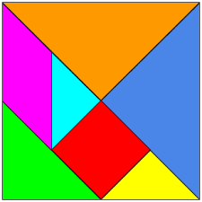
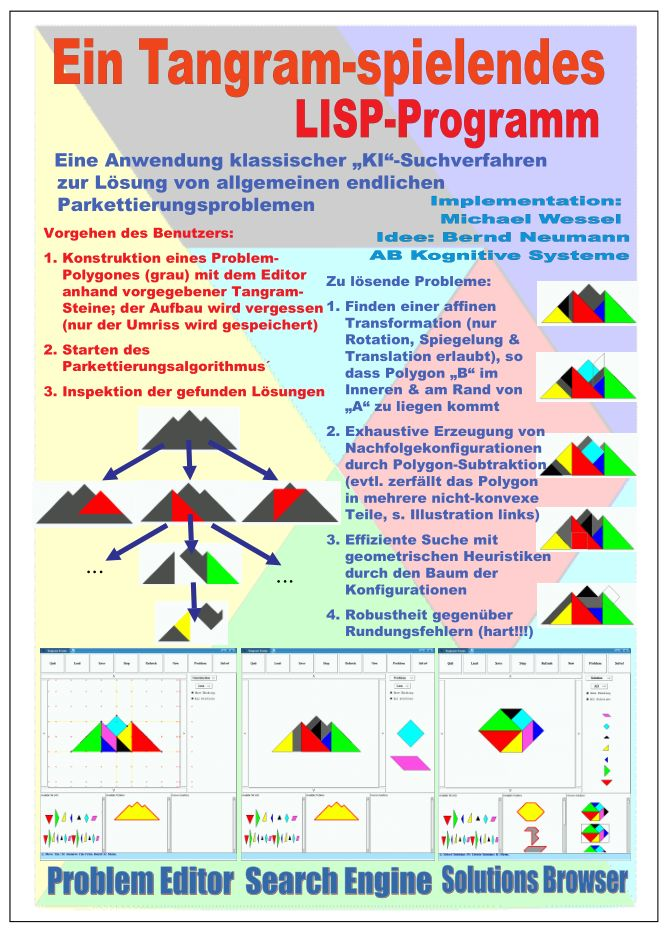
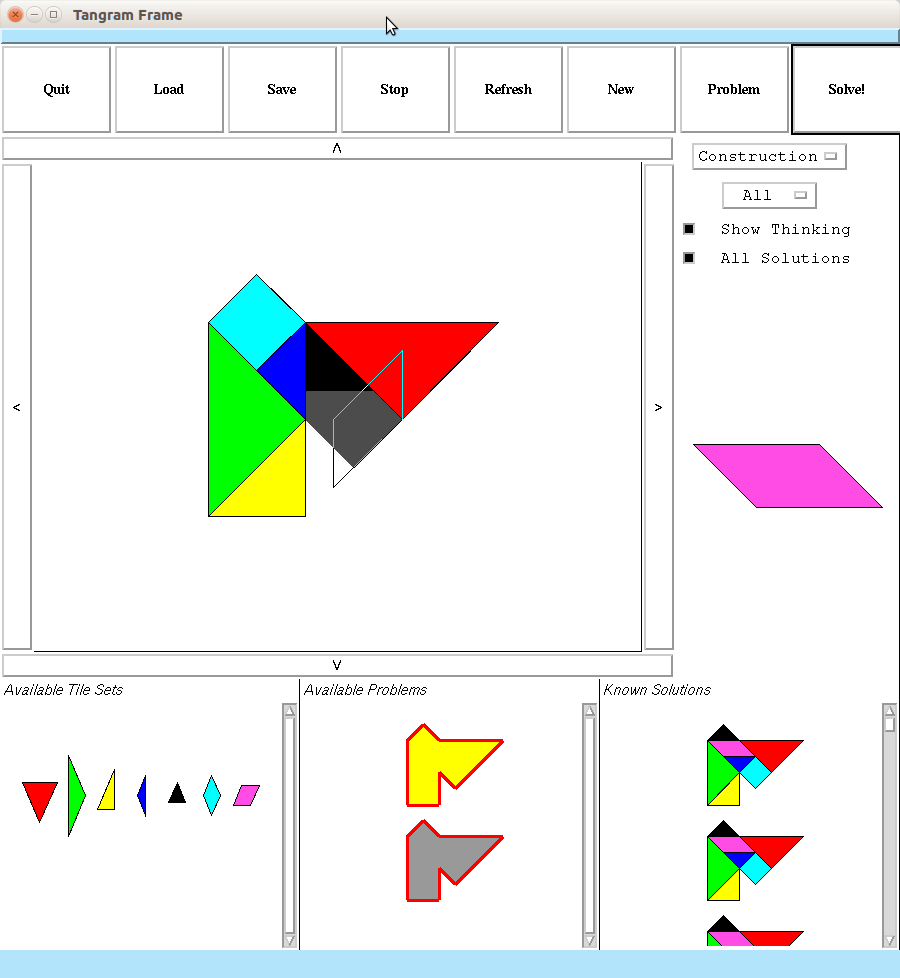

# Common-Lisp-Tangram-Solver
A Tangram Puzzle Solver in Common Lisp that is capable of solving arbitrary geometric tiling problems, utilizing CLIM (Common Lisp Interface Manager) for its GUI. 



## About 

This was written in Common Lisp in 2003, using CLIM (Common Lisp
Interface Manager) for the GUI. It compiles with LispWorks 6.1 & CLIM,
on Windows and Linux.

Here is a [2003 poster about the project, in German](tangram-poster.pdf). 



Check out [the YouTube video to see it in action!](https://www.youtube.com/watch?v=UUn_np8I3zg) 

On my 2012 iCore 7 2.4 GZ 8 GB Ubuntu Xenial PC, thanks to its
geometric heuristics, it takes ~ 10 seconds to solve the following
problem:





AFAIK, this is the only Tangram solver in existence (there are very
few out there!) capable of solving arbitary geometric tiling problems
purely by means of geometrical search / computational geometry. 


## History 

I resurrected the code in March 2021 and fixed some major bugs that
were responsible for severe incompleteness. It is performing much
better by now!

The geometric substrate support functions were written by the author
during his computer science master and PhD endeavors, from 1996 to
2003. The Tangram solver was written in 2003.


## Installation (Windows, Linux, Mac)

You will need LisWorks (6.1, 7.1) with CLIM if you want to run it from
source (or even build the application). Else, exectuables for Linux32
and Windows are provided in this repository (see below).

On Linux, I needed to install a number of (in my case, 32bit) legacy
libraries, like (32bit) Motif etc. in order to get is going. It is
more straightforward on Windows (tested on 64bit Windows 10).  

The well-known Lisp hacker `Lispm` (Rainer Joswig) also reported that
it runs on an Apple Silicon Mac with M1 processor under 64bit ARM
Linux.](https://twitter.com/RainerJoswig/status/1369401013308973060).
Contact Rainer for details (I don't have a Mac).

## Executables 

There are [executables provided for Linux32 and Windows.](./builds/) 

## Loading / Usage 

If you want to run it from source, check out the
[`src/tangram-sysdcl.lisp`](./src/tangram-sysdcl.lisp).  Adjust the
logical "tangram" pathname to match your environment. Then, as shown
at the end of the file, do a

```
(compile-system "tangram")
(load-system "tangram")
(tangram::tangram)

``` 

There are also [`deliver.lisp`](src/deliver.lisp) scripts for
[Linux32](build-tangram-lw61.sh) and
[Windows](build-tangram-lw61.bat). 

For the Mac, you'll probably have to collect the "FLI Templates", and
then change the [`tangram-sysdcl.lisp`](./src/tangram-sysdcl.lisp)
accordingly:

```
(define-system tangram
    (:default-pathname "tangram:")
    (:serial "tangram-packages"
   #+:linux
   "tangram-templates"
   tangram-aux tangram-persistence tangram-geometry
   tangram-main tangram-gui))
```

The process of "FLI Template" collection is described [in the
LispWorks
manual.](http://www.lispworks.com/documentation/lw71/DV/html/delivery-167.htm)

Or, contact Lisp hacker `Lispm` (Rainer Joswig) who got deliver to
work with an Apple Silicon Mac with M1 processor under 64bit ARM
Linux.](https://twitter.com/RainerJoswig/status/1369401013308973060).

